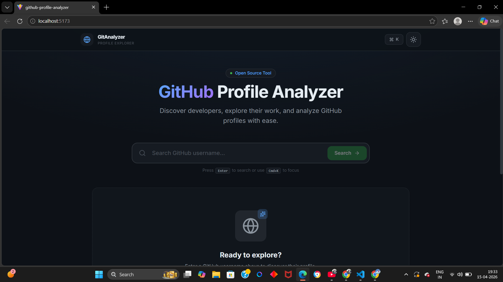
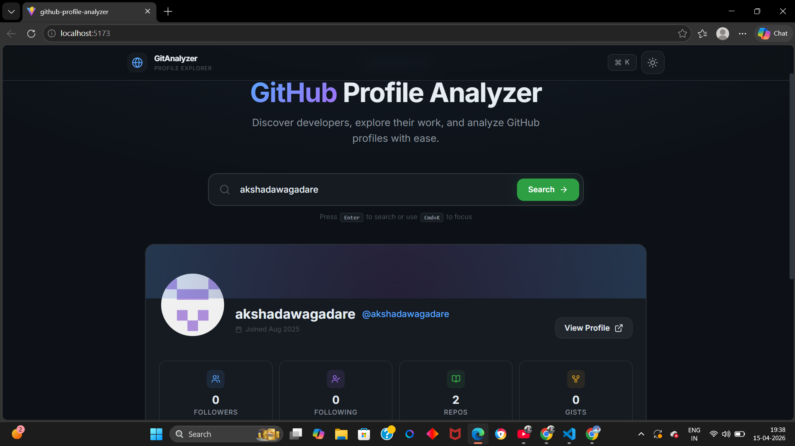

# 🚀 GitHub Profile Analyzer

Search any GitHub username and instantly get detailed insights — repositories, top languages, and developer activity in one clean dashboard.

---

## 🌐 Live Demo

👉 [github-profile-analyzer-rose.vercel.app](https://github-profile-analyzer-rose.vercel.app)

---

## 📸 Screenshots




---

## ✨ Features

- 🔍 Search any GitHub username instantly
- 📊 View profile stats and repository details
- 💻 Analyze top programming languages used
- ⚡ Real-time data fetched via GitHub REST API
- 🎨 Responsive and clean UI with TailwindCSS
- 💀 Loading skeleton while data is being fetched
- 📭 Empty state for users with no repositories
- ❌ Graceful error handling for invalid usernames

---

## 🛠 Tech Stack

| Layer | Tech |
|-------|------|
| Frontend | React.js, Vite, TailwindCSS, JavaScript |
| API | GitHub REST API |
| Deployment | Vercel |

---

## 📂 Project Structure

```
github-profile-analyzer/
├── dist/
├── public/
├── screenshots/
│   ├── home.png
│   └── profile.png
├── src/
│   ├── assets/
│   ├── components/
│   │   ├── EmptyState.jsx
│   │   ├── ErrorState.jsx
│   │   ├── LoadingSkeleton.jsx
│   │   ├── Navbar.jsx
│   │   ├── ProfileCard.jsx
│   │   ├── RepoList.jsx
│   │   └── SearchBar.jsx
│   ├── pages/
│   │   └── Home.jsx
│   ├── Services/
│   │   └── githubApi.js
│   ├── App.css
│   ├── App.jsx
│   ├── index.css
│   └── main.jsx
├── .gitignore
├── eslint.config.js
├── index.html
├── package-lock.json
├── package.json
├── postcss.config.js
├── tailwind.config.js
└── vite.config.js
```

---

## ⚙️ Setup Instructions

### 1. Clone the Repository

```bash
git clone https://github.com/akshadawagadare/github-profile-analyzer.git
cd github-profile-analyzer
```

### 2. Install Dependencies

```bash
npm install
```

### 3. Start Development Server

```bash
npm run dev
```

App runs on: `http://localhost:5173`

### 4. Build for Production

```bash
npm run build
```

---

## 🔌 GitHub REST API Endpoints Used

All API calls are centralized in `src/Services/githubApi.js`.

### Get GitHub Profile
```
GET https://api.github.com/users/:username
```

Sample response:
```json
{
  "name": "Akshada Wagadare",
  "public_repos": 20,
  "followers": 10,
  "following": 5
}
```

### Get Repositories
```
GET https://api.github.com/users/:username/repos
```

Sample response:
```json
[
  {
    "name": "github-profile-analyzer",
    "language": "JavaScript",
    "stargazers_count": 5,
    "forks_count": 2
  }
]
```

---

## 🧩 Component Overview

| Component | Description |
|-----------|-------------|
| `Navbar.jsx` | Top navigation bar |
| `SearchBar.jsx` | Username input and search trigger |
| `ProfileCard.jsx` | Displays avatar, bio, and profile stats |
| `RepoList.jsx` | Lists repositories with language and star info |
| `LoadingSkeleton.jsx` | Placeholder UI shown while data loads |
| `EmptyState.jsx` | Shown when a user has no public repositories |
| `ErrorState.jsx` | Shown on invalid username or API failure |

---

## 🧠 How It Works

1. User enters a GitHub username in `SearchBar`
2. `githubApi.js` calls the GitHub REST API
3. `ProfileCard` renders avatar, bio, followers, and repo count
4. `RepoList` displays all public repositories
5. Top languages are calculated from repository data
6. `LoadingSkeleton` shows during fetch, `ErrorState` on failure, `EmptyState` if no repos exist

---

## 🚧 Future Improvements

- 📈 Contribution graph visualization
- 🌙 Dark mode support
- 💾 Save and compare multiple profiles
- 🔐 GitHub OAuth login for higher API rate limits
- 📤 Export profile stats as PDF

---

## ⚠️ Notes

- GitHub REST API allows **60 unauthenticated requests/hour** per IP
- To increase the limit, add a GitHub Personal Access Token to your request headers inside `githubApi.js`
- Never expose tokens in frontend code — use a `.env` file and Vite's `import.meta.env`

---

## 👩‍💻 Author

**Akshada Wagadare**
[GitHub](https://github.com/akshadawagadare) • [LinkedIn](https://www.linkedin.com/in/akshadawagadare/)

---

⭐ If this helped you, consider starring the repo!